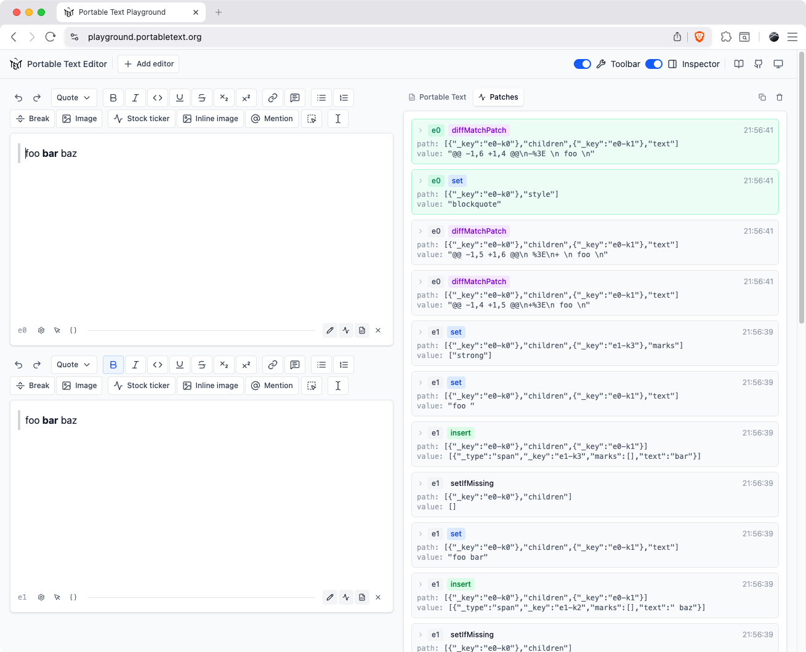

<picture>
  <source media="(prefers-color-scheme: dark)" srcset="https://raw.githubusercontent.com/portabletext/portabletext/master/logo-white.svg?sanitize=true">
  
</picture>

# Portable Text Editor Monorepo

This monorepo contains the official [Portable Text](https://github.com/portabletext/portabletext) editor and related packages for building rich text editing experiences.

For documentation and guides, visit [portabletext.org](https://www.portabletext.org/).

Or try the editor in the [Portable Text Playground](https://playground.portabletext.org/).

<picture>
  <source media="(prefers-color-scheme: dark)" srcset=".github/assets/playground-dark.png">
  
</picture>

## Core

| Package                                        | Description                                                    |
| ---------------------------------------------- | -------------------------------------------------------------- |
| [`@portabletext/editor`](./packages/editor/)   | The official editor for editing Portable Text                  |
| [`@portabletext/schema`](./packages/schema/)   | Define and compile Portable Text schemas with full type safety |
| [`@portabletext/toolbar`](./packages/toolbar/) | React hooks for building toolbars and related UI components    |

## Editor Plugins

| Package                                                                                        | Description                                                               |
| ---------------------------------------------------------------------------------------------- | ------------------------------------------------------------------------- |
| [`@portabletext/plugin-character-pair-decorator`](./packages/plugin-character-pair-decorator/) | Automatically match a pair of characters and decorate the text in between |
| [`@portabletext/plugin-emoji-picker`](./packages/plugin-emoji-picker/)                         | Easily configure an Emoji Picker for the Portable Text Editor             |
| [`@portabletext/plugin-input-rule`](./packages/plugin-input-rule/)                             | Easily configure Input Rules in the Portable Text Editor                  |
| [`@portabletext/plugin-markdown-shortcuts`](./packages/plugin-markdown-shortcuts/)             | Adds helpful Markdown shortcuts to the editor                             |
| [`@portabletext/plugin-one-line`](./packages/plugin-one-line/)                                 | Restricts the Portable Text Editor to a single line                       |
| [`@portabletext/plugin-paste-link`](./packages/plugin-paste-link/)                             | Allows pasting links in the Portable Text Editor                          |
| [`@portabletext/plugin-typeahead-picker`](./packages/plugin-typeahead-picker/)                 | Generic typeahead picker infrastructure (emoji, mentions, slash commands) |
| [`@portabletext/plugin-sdk-value`](./packages/plugin-sdk-value/)                               | Connects a Portable Text Editor with a Sanity document using the SDK      |
| [`@portabletext/plugin-typography`](./packages/plugin-typography/)                             | Automatically transform text to typographic variants                      |

## Other Libraries

| Package                                                              | Description                                              |
| -------------------------------------------------------------------- | -------------------------------------------------------- |
| [`@portabletext/block-tools`](./packages/block-tools/)               | Various tools for processing Portable Text               |
| [`@portabletext/markdown`](./packages/markdown/)                     | Convert Portable Text to Markdown and back again         |
| [`@portabletext/keyboard-shortcuts`](./packages/keyboard-shortcuts/) | Platform-aware keyboard shortcuts                        |
| [`@portabletext/sanity-bridge`](./packages/sanity-bridge/)           | Convert between Sanity schemas and Portable Text schemas |
| [`@portabletext/patches`](./packages/patches/)                       | Apply Sanity patches to a value                          |
| [`@portabletext/test`](./packages/test/)                             | Testing utilities for the Portable Text Editor           |
| [`@portabletext/racejar`](./packages/racejar/)                       | A testing framework agnostic Gherkin driver              |
