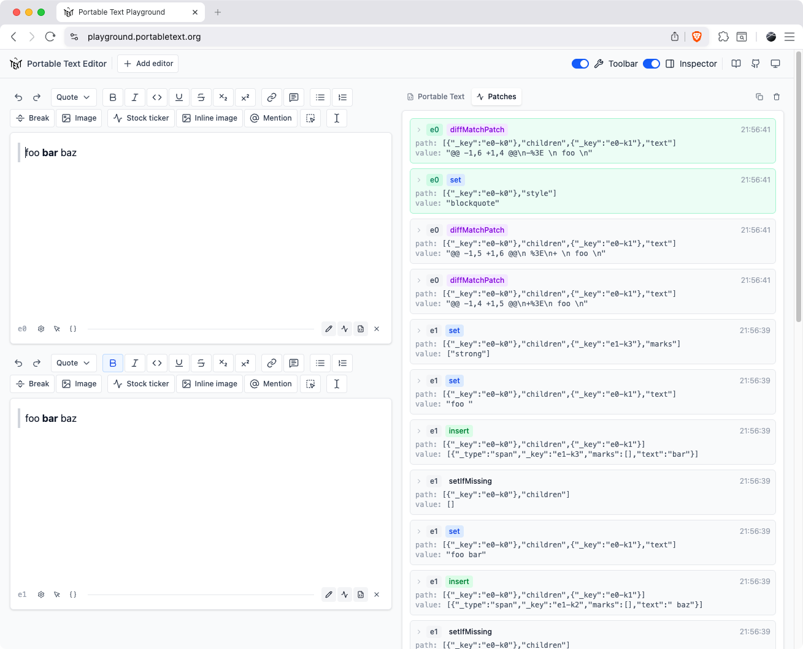

<picture>
  <source media="(prefers-color-scheme: dark)" srcset="https://raw.githubusercontent.com/portabletext/portabletext/master/logo-white.svg?sanitize=true">
  
</picture>

# Portable Text Editor Monorepo

[Portable Text](https://github.com/portabletext/portabletext) is an open specification for structured block content. Rich text, images, code blocks, and any custom type you define, stored as JSON and renderable anywhere.

This monorepo contains [`@portabletext/editor`](./packages/editor/), the officially supported editor for working with Portable Text content. It's a headless, schema-driven block content editor for React: you bring the UI, the editor handles the editing. The other packages in this repository support editor work, including schema definition, toolbar hooks, plugins, conversion to and from HTML and Markdown, and testing utilities.

> **Looking to render Portable Text?** The renderers (`@portabletext/react`, `@portabletext/to-html`, and friends) live in separate repositories. See [Render Portable Text](https://www.portabletext.org/rendering/) for the full picture.

For documentation and guides, visit [portabletext.org](https://www.portabletext.org/). To try the editor, head to the [Portable Text Playground](https://playground.portabletext.org/).

<picture>
  <source media="(prefers-color-scheme: dark)" srcset=".github/assets/playground-dark.png">
  
</picture>

## Core

| Package                                        | Description                                                    |
| ---------------------------------------------- | -------------------------------------------------------------- |
| [`@portabletext/editor`](./packages/editor/)   | The official editor for editing Portable Text                  |
| [`@portabletext/schema`](./packages/schema/)   | Define and compile Portable Text schemas with full type safety |
| [`@portabletext/toolbar`](./packages/toolbar/) | React hooks for building toolbars and related UI components    |

## Editor plugins

| Package                                                                                        | Description                                                               |
| ---------------------------------------------------------------------------------------------- | ------------------------------------------------------------------------- |
| [`@portabletext/plugin-character-pair-decorator`](./packages/plugin-character-pair-decorator/) | Automatically match a pair of characters and decorate the text in between |
| [`@portabletext/plugin-dnd`](./packages/plugin-dnd/)                                           | Track the drop position during drag and drop for custom drop indicators   |
| [`@portabletext/plugin-emoji-picker`](./packages/plugin-emoji-picker/)                         | Easily configure an Emoji Picker for the Portable Text Editor             |
| [`@portabletext/plugin-input-rule`](./packages/plugin-input-rule/)                             | Easily configure Input Rules in the Portable Text Editor                  |
| [`@portabletext/plugin-list-index`](./packages/plugin-list-index/)                             | Compute the list index of each list item for custom list rendering        |
| [`@portabletext/plugin-markdown-shortcuts`](./packages/plugin-markdown-shortcuts/)             | Add helpful Markdown shortcuts to the editor                              |
| [`@portabletext/plugin-one-line`](./packages/plugin-one-line/)                                 | Restrict the Portable Text Editor to a single line                        |
| [`@portabletext/plugin-paste-link`](./packages/plugin-paste-link/)                             | Allow pasting links in the Portable Text Editor                           |
| [`@portabletext/plugin-sdk-value`](./packages/plugin-sdk-value/)                               | Connect a Portable Text Editor with a Sanity document using the SDK       |
| [`@portabletext/plugin-typeahead-picker`](./packages/plugin-typeahead-picker/)                 | Build typeahead pickers (emoji, mentions, slash commands)                 |
| [`@portabletext/plugin-typography`](./packages/plugin-typography/)                             | Automatically transform text to typographic variants                      |

## Other libraries

| Package                                                              | Description                                                        |
| -------------------------------------------------------------------- | ------------------------------------------------------------------ |
| [`@portabletext/html`](./packages/html/)                             | Convert HTML to Portable Text                                      |
| [`@portabletext/block-tools`](./packages/block-tools/)               | Sanity-flavored HTML to Portable Text (wraps `@portabletext/html`) |
| [`@portabletext/markdown`](./packages/markdown/)                     | Convert Portable Text to Markdown and back again                   |
| [`@portabletext/keyboard-shortcuts`](./packages/keyboard-shortcuts/) | Platform-aware keyboard shortcuts                                  |
| [`@portabletext/sanity-bridge`](./packages/sanity-bridge/)           | Convert between Sanity schemas and Portable Text schemas           |
| [`@portabletext/patches`](./packages/patches/)                       | Apply Sanity patches to a value                                    |
| [`@portabletext/test`](./packages/test/)                             | Testing utilities for the Portable Text Editor                     |
| [`racejar`](./packages/racejar/)                                     | A testing framework agnostic Gherkin driver                        |

## Contributing

This is a [pnpm](https://pnpm.io/) and [Turborepo](https://turbo.build/) monorepo.

```sh
pnpm install   # install dependencies
pnpm build     # build every package
```

Run `pnpm test` for the test suites and `pnpm check:types`, `pnpm check:lint`, and `pnpm check:format` for the checks CI runs.

## License

[MIT](./LICENSE) © [Sanity.io](https://www.sanity.io/)
