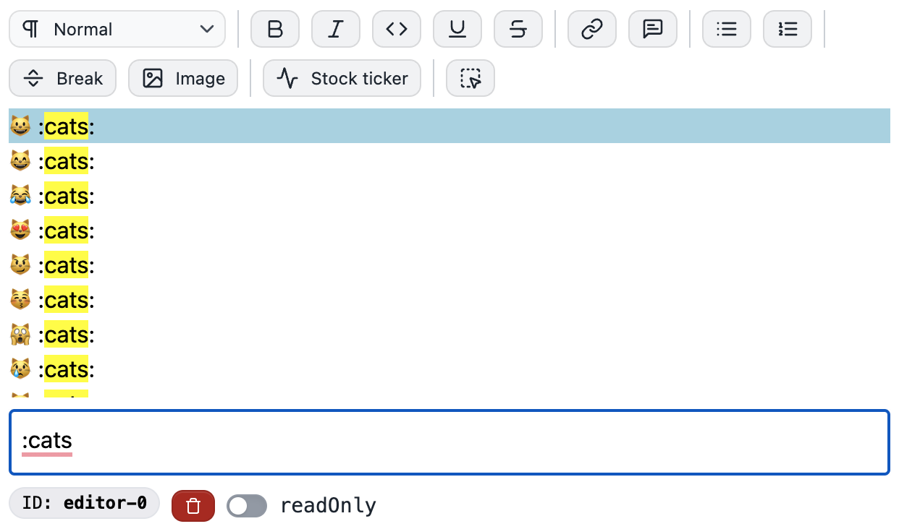

import {CardGrid, LinkCard} from '@astrojs/starlight/components'

Below are some common behavior examples. You can also find a list of core behaviors [on GitHub](https://github.com/portabletext/editor/tree/main/packages/editor/src/behaviors).

To add these to your editor, first import `defineBehavior` and optionally the `coreBehaviors`.

```tsx
import {coreBehaviors, defineBehavior} from '@portabletext/editor'
```

Then, register the behavior with the `EditorProvider`. Spread the core behaviors if you want to include them.

```tsx
<EditorProvider
  initialConfig={{
    schemaDefinition,
    behaviors: [
      ...coreBehaviors,
      // Your behaviors here
      logInsertText,
    ],
  }}
>
  {/* ... */}
</EditorProvider>
```

Read more about using behaviors and building your own with these guides:

<CardGrid>
  <LinkCard
    title="Create a custom behavior"
    description="Learn to create and register a custom behavior"
    href="/guides/create-behavior/"
  />
  <LinkCard
    title="Behaviors"
    description="Learn more about the Behavior API"
    href="/concepts/behavior/"
  />
</CardGrid>

## Log inserted text

Send and `effect` type action along with an `effect` to perform side effects.

```js
const logInsertText = defineBehavior({
    on: 'insert.text',
    actions: [
      ({event}) => [
        {
          type: 'effect',
          effect: () => {
            console.log(event)
          },
        },
        event,
      ],
    ],
  }
```

## Auto-close parenthesis

You can write behaviors to auto-close common paired characters. This example closes parenthesis, and then moves the cursor in between the two characters. This logic can expand to cover more sets.

```js
const autoCloseParens = defineBehavior({
  on: 'insert.text',
  guard: ({context, event}) => {
    return event.text === '('
  },
  actions: [
    ({event, context}) => [
      // Send the original event that includes the '('
      event,
      // Send a new insert.text event with a closing parenthesis
      {
        type: 'insert.text',
        text: ')',
      },
      // Send a select event to move the cursor in between the parens
      {
        type: 'select',
        selection: {
          anchor: {
            path: context.selection.anchor.path,
            offset: context.selection.anchor.offset + 1,
          },
          focus: {
            path: context.selection.focus.path,
            offset: context.selection.focus.offset + 1,
          },
        },
      },
    ],
  ],
})
```

## Emoji Picker

Using a factory to create behaviors, a state machine, and custom components results in an emoji picker that triggers when you insert `:`.



Test it out in the [Playground](https://playground.portabletext.org).

- [View the behavior source](https://github.com/portabletext/editor/blob/main/packages/editor/src/behaviors/behavior.emoji-picker.ts).
- [View the editor source](https://github.com/portabletext/editor/blob/main/apps/playground/src/editor.tsx).

You can leverage the behavior by importing `createEmojiPickerBehaviors` from `@portabletext/editor/behaviors`. See the editor source above for a usage example.

## Raise a synthetic event

Sometimes you want to trigger a synthetic event from within an action. This sends the event back to the editor, where the editor treats it like any other event.

```tsx
const raisedUppercaseA = defineBehavior({
  on: 'insert.text',
  guard: ({event, context}) => event.text === 'a',
  actions: [
    ({event, context}) => [
      {type: 'raise', event: {type: 'insert.text', text: 'A'}},
    ],
  ],
})
```

The `raise` action also has a shorthand function:

```tsx
const raisedUppercaseA = defineBehavior({
  on: 'insert.text',
  guard: ({event, context}) => event.text === 'a',
  actions: [({event, context}) => [raise({type: 'insert.text', text: 'A'})]],
})
```

:::note
Be careful when raising events, as this technique can lead to infinite loops if behaviors dispatch actions and events that trigger one another.
:::
