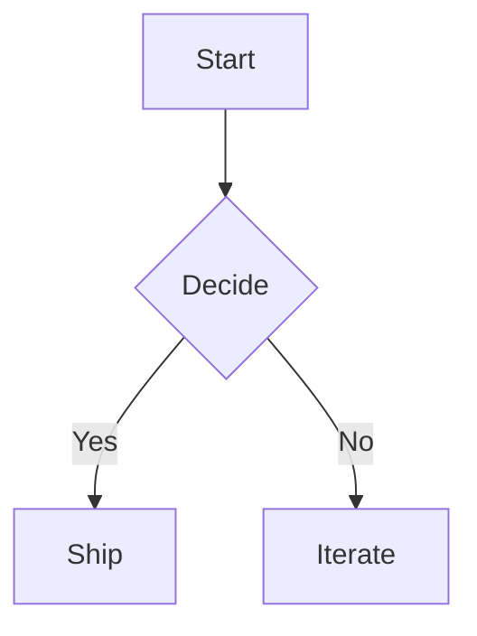

# Portable Text, in markdown

This document is a stress test. It exercises every markdown concept the editor and `@portabletext/markdown` can represent. Edit on either side and watch the other follow.

## Headings and paragraphs

Six heading levels.

# h1

## h2

### h3

#### h4

##### h5

###### h6

Paragraphs separate with a blank line.

A second paragraph, with **strong**, _em_, `inline code`, and ~~strikethrough~~ inline marks. Plus a [link](https://portabletext.org 'the Portable Text spec') and a bare autolink: <https://github.com/portabletext/editor>.

## Lists

A bullet list:

- First item.
- Second item, with **bold** and `code`.
- Third item.

A numbered list:

1. First.
2. Second.
3. Third.

A task list:

- [x] Schema enforcement applies at every depth.
- [ ] Migrate custom plugins.
  - [x] Audit `renderBlock` callbacks.
  - [ ] Register containers where it pays off.

Nested, three levels deep, with rich content inside list items:

- Outer bullet.
  - Inner bullet that holds a code block:
    ```ts
    const works = 'A code block, inside a list item, two levels deep'
    ```
  - Inner bullet that holds a callout:
    > [!TIP]
    > Containers nest. Callouts inside list items inside lists.
  - Three levels in:
    - Same `defineContainer` registration handles every depth.

      

## Blockquotes

> A simple blockquote. The kind you'd find on a personal blog circa 2008.

> Multiple lines.
> Same blockquote, soft-wrapped.

> A blockquote that holds a code block:
>
> ```ts
> markdownToPortableText(input)
> ```

## Code

A fenced code block, with language:

```ts
import {defineContainer, defineLeaf} from '@portabletext/editor'

const calloutContainer = defineContainer({
  scope: '$..callout',
  field: 'content',
  render: ({attributes, children}) => (
    <aside {...attributes}>{children}</aside>
  ),
})
```

A fenced code block, no language:

```
plain code, no syntax highlighting
```

A code block with mermaid syntax (TODO: render as a diagram):



## Tables

| Feature     | v6                    | v7                     |
| ----------- | --------------------- | ---------------------- |
| Code blocks | flat string           | container, line blocks |
| Tables      | block-object, opaque  | container, editable    |
| Callouts    | not supported         | container with tone    |
| Lists       | flat `listItem` field | flat _or_ container    |

## Callouts

> [!NOTE]
> A note. The neutral tone, sky blue.

> [!TIP]
> A tip. Emerald, encouraging.

> [!IMPORTANT]
> Important. Violet, demanding attention.

> [!WARNING]
> A warning. Amber, cautionary.

> [!CAUTION]
> Caution. Rose, this is the serious one.

## Images

Block image:


Inline image (in a paragraph): here's an inline  badge.

## Horizontal rule

Above the rule.

---

Below the rule.

## HTML

A raw HTML block:

<div style="padding: 8px; background: #fef3c7; border-radius: 4px;">
  Raw HTML, passed through as a block-object.
</div>

## Closing

That's the kitchen sink. Anything missing? File a friction note in `apps/markdown-editor`'s spec.
