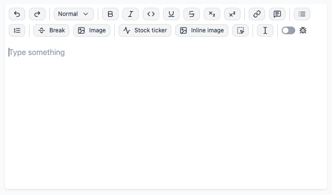
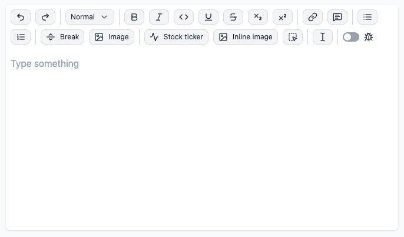

# `@portabletext/plugin-typography`

> Automatically transform text to typographic variants

Drop-in plugin for the [Portable Text Editor](https://www.portabletext.org/) to enable a wide variety of typographic transformations:



Automatically handles smart undo with <kbd>Backspace</kbd> right after insertion:



## Usage

Import the `TypographyPlugin` React component and place it inside the `EditorProvider`:

```tsx
import {
  defineSchema,
  EditorProvider,
  PortableTextEditable,
} from '@portabletext/editor'
import {TypographyPlugin} from '@portabletext/plugin-typography'

const schemaDefinition = defineSchema({
  // Your Schema
})

function App() {
  return (
    <EditorProvider
      initialConfig={{
        schemaDefinition,
      }}
    >
      <PortableTextEditable />
      <TypographyPlugin /> {/* <-- plugin added */}
    </EditorProvider>
  )
}
```

## Rules Included

The plugin includes the following typographic transformation rules:

**Default rules:**

| Name                  | Conversion    |
| --------------------- | ------------- |
| `emDash`              | `--` → `—`    |
| `ellipsis`            | `...` → `…`   |
| `openingDoubleQuote`  | `"` → `“`     |
| `closingDoubleQuote`  | `"` → `”`     |
| `openingSingleQuote`  | `'` → `‘`     |
| `closingSingleQuote`  | `'` → `’`     |
| `leftArrow`           | `<-` → `←`    |
| `rightArrow`          | `->` → `→`    |
| `copyright`           | `(c)` → `©`  |
| `trademark`           | `(tm)` → `™` |
| `servicemark`         | `(sm)` → `℠`  |
| `registeredTrademark` | `(r)` → `®`  |

**Optional rules:**

| Name               | Conversion                       |
| ------------------ | -------------------------------- |
| `oneHalf`          | `1/2` → `½`                      |
| `plusMinus`        | `+/-` → `±`                      |
| `notEqual`         | `!=` → `≠`                       |
| `laquo`            | `<<` → `«`                       |
| `raquo`            | `>>` → `»`                       |
| `multiplication`   | `*` or `x` between numbers → `×` |
| `superscriptTwo`   | `^2` → `²`                       |
| `superscriptThree` | `^3` → `³`                       |
| `oneQuarter`       | `1/4` → `¼`                      |
| `threeQuarters`    | `3/4` → `¾`                      |

## Configuring what Rules are Enabled

Use the `rules` prop on the `TypographyPlugin` to control which rules are enabled:

```tsx
return <TypographyPlugin rules={{multiplication: 'on'}} />
```

`emDash`, `ellipsis`, `openingDoubleQuote`, `closingDoubleQuote`, `openingSingleQuote`, `closingSingleQuote`, `leftArrow`, `rightArrow`, `copyright`, `trademark`, `servicemark`, and `registeredTrademark` are `'on'` by default.

## Controlling when Text Transformations Run

The `TypographyPlugin` has an optional `guard` prop that accepts any type of `BehaviorGuard`. Here, you'll have access to the current `EditorSnapshot` as well as information about the current rule being matched.

Because disallowing text transformations inside code is a common use case, this plugin ships a built-in `createDecoratorGuard` function. use that to create a `guard` that only allows text transformations inside certain decorators:

```tsx
import {
  createDecoratorGuard,
  TypographyPlugin,
} from '@portabletext/plugin-typography'

return (
  <TypographyPlugin
    guard={createDecoratorGuard({
      decorators: ({context}) =>
        context.schema.decorators.flatMap((decorator) =>
          decorator.name === 'code' ? [] : [decorator.name],
        ),
    })}
  />
)
```

## Using Individual Rules with `InputRulePlugin`

All included typographic rules are exported from the plugin. To use them in your own abstraction, import them from this from plugin and use them with the `InputRulePlugin`:

```tsx
import {InputRulePlugin} from '@portabletext/plugin-input-rule'
import {ellipsisRule, emDashRule} from '@portabletext/plugin-typography'

return <InputRulePlugin rules={[emDashRule, ellipsisRule]} />
```
